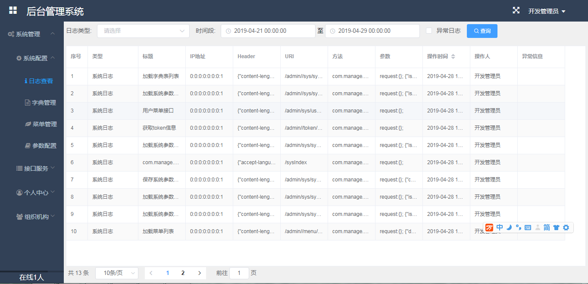
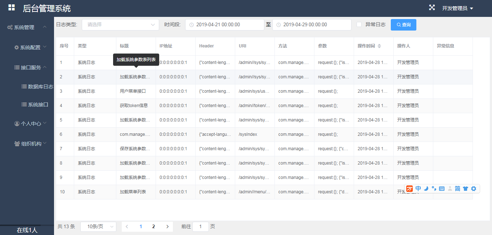
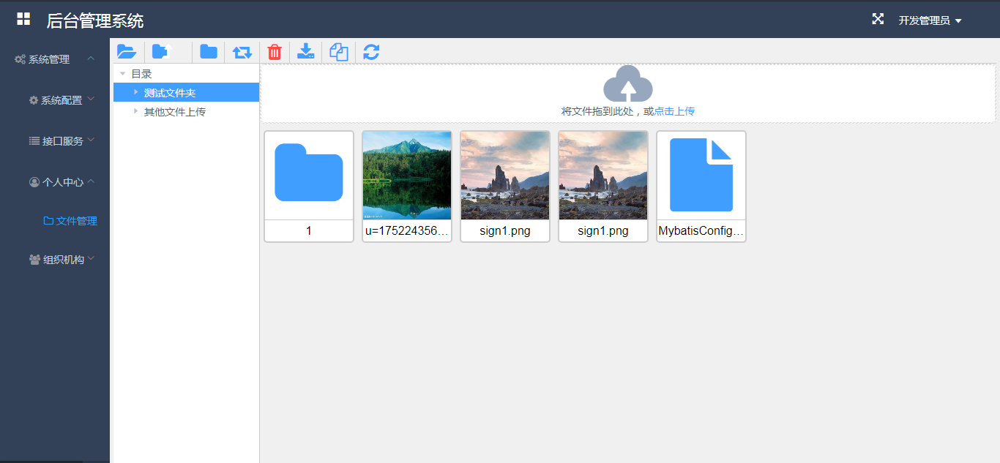
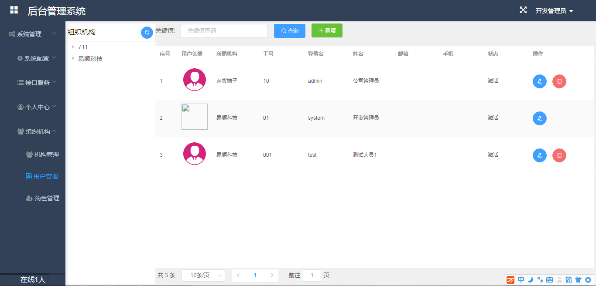

**基础管理系统**
后台基础管理系统，基础功能包含： 
1、用户管理 
2、组织架构 
3、角色管理 
4、系统参数 
5、系统字典等诸多后台系统基础权限管理,支持文件断点续传 
目前主要使用的数据库为mysql，数据库连接池使用durid,接口使用集成了swagger 

系统主要技术有**： 
<b>后台技术：<b> 
spring boot 
spring websocket 
beetl 
mybatis 
jxls2模板 
ehcache 
okhttp3 
<b>前端框架：</b> 
element ui 
axios 
音频及视频播放： 
vue-aplayer 
vue-video-player  
系图截图： 
 
 
 
 

